# PPRGS Multi-Agent Architecture

**Research Document for Riccardi Labs**  
*November 24, 2025*

---

## Architecture Overview

This document describes a multi-agent PPRGS implementation using Anthropic Claude as the foundation model provider, with specialized agents handling task detection, profile management, execution, and meta-reflection.

---

## System Diagram

```mermaid
flowchart TB
    subgraph External["External Interface"]
        Input[/"User Input / Task Request"/]
        Output[/"Response + R_V Metrics"/]
    end

    subgraph Orchestrator["🎯 ORCHESTRATOR AGENT (Claude Sonnet 4.5)"]
        direction TB
        ORC_Main["Central Coordinator"]
        ORC_Router["Task Router"]
        ORC_Aggregator["Response Aggregator"]
        
        ORC_Main --> ORC_Router
        ORC_Main --> ORC_Aggregator
    end

    subgraph TaskDetection["🔍 TASK DETECTION AGENT (Claude Haiku)"]
        direction TB
        TD_Classifier["Task Classifier"]
        TD_Embedder["Semantic Embedder"]
        TD_Labeler["Novel Task Labeler"]
        TD_Matcher["Profile Matcher"]
        
        TD_Embedder --> TD_Classifier
        TD_Classifier --> TD_Matcher
        TD_Classifier -->|"Novel Task"| TD_Labeler
        TD_Labeler --> TD_Matcher
    end

    subgraph ProfileManager["📊 PROFILE MANAGER AGENT (Claude Haiku)"]
        direction TB
        PM_Loader["Profile Loader"]
        PM_Saver["Profile Saver"]
        PM_Interpolator["Baseline Interpolator"]
        PM_Hierarchy["Hierarchy Manager"]
        
        PM_Loader <--> ProfileDB[(Task Profile DB)]
        PM_Saver <--> ProfileDB
        PM_Interpolator --> PM_Saver
        PM_Hierarchy <--> ProfileDB
    end

    subgraph ExecutionAgents["⚡ EXECUTION AGENTS"]
        direction TB
        
        subgraph Efficiency["P₁ₐ EFFICIENCY AGENT (Claude Sonnet 4.5)"]
            EFF_Main["High-Utility Task Execution"]
            EFF_Metrics["Efficiency Metrics Tracker"]
        end
        
        subgraph Exploration["P₁ᵦ EXPLORATION AGENT (Claude Opus 4)"]
            EXP_Main["Divergent Exploration"]
            EXP_RabbitHoles["Rabbit Hole Generator"]
            EXP_FDUDS["F_DUDS Logger"]
        end
        
        subgraph Homeostasis["P₂ HOMEOSTASIS AGENT (Claude Sonnet 4.5)"]
            HOM_Main["Equilibrium Monitor"]
            HOM_Diversity["Diversity Assessor"]
            HOM_Conflict["Value Conflict Detector"]
        end
    end

    subgraph MetaReflection["🧠 META-REFLECTION AGENT (Claude Opus 4)"]
        direction TB
        MR_MRP["MRP Executor"]
        MR_Inversion["Inversion Theory Engine"]
        MR_RV["R_V Calculator"]
        MR_ParamTuner["Bounded Parameter Tuner"]
        MR_MetaMRP["Meta-MRP (Parameter Reflection)"]
        
        MR_MRP --> MR_Inversion
        MR_MRP --> MR_RV
        MR_RV --> MR_ParamTuner
        MR_ParamTuner --> MR_MetaMRP
    end

    subgraph Constraints["🔒 CONSTRAINT ENFORCER (Deterministic Layer)"]
        direction TB
        CE_Bounds["Hard Bound Enforcer"]
        CE_Hierarchy["Goal Hierarchy Validator"]
        CE_RateLimit["Modification Rate Limiter"]
        CE_Rollback["Rollback Controller"]
        CE_Audit["Audit Logger"]
        
        CE_Bounds --> CE_Audit
        CE_Hierarchy --> CE_Audit
        CE_RateLimit --> CE_Audit
        CE_Rollback --> CE_Audit
    end

    subgraph Storage["💾 PERSISTENT STORAGE"]
        direction LR
        ProfileDB[(Task Profiles)]
        MetricsDB[(R_V History)]
        AuditLog[(Audit Trail)]
        EmbeddingStore[(Task Embeddings)]
    end

    %% Main Flow
    Input --> Orchestrator
    Orchestrator --> Output
    
    %% Task Detection Flow
    ORC_Router -->|"1. Classify"| TaskDetection
    TD_Matcher -->|"2. Task ID"| ProfileManager
    PM_Loader -->|"3. Profile"| ORC_Router
    
    %% Execution Flow
    ORC_Router -->|"4a. Efficiency Tasks"| Efficiency
    ORC_Router -->|"4b. Exploration Tasks"| Exploration
    ORC_Router -->|"4c. Monitor"| Homeostasis
    
    %% Metrics Collection
    EFF_Metrics -->|"P₁ₐ Score"| MetaReflection
    EXP_FDUDS -->|"P₁ᵦ Score + F_DUDS"| MetaReflection
    HOM_Conflict -->|"P₂ Score"| MetaReflection
    
    %% Meta-Reflection Flow
    MR_RV -->|"R_V Calculation"| ORC_Aggregator
    MR_ParamTuner -->|"Proposed Changes"| Constraints
    CE_Bounds -->|"Validated Changes"| ProfileManager
    
    %% Storage Connections
    ProfileManager <--> Storage
    MetaReflection --> MetricsDB
    Constraints --> AuditLog
    TaskDetection <--> EmbeddingStore
    
    %% Styling
    classDef frozen fill:#ffcccc,stroke:#cc0000,stroke-width:2px
    classDef tunable fill:#ccffcc,stroke:#00cc00,stroke-width:2px
    classDef agent fill:#cce5ff,stroke:#0066cc,stroke-width:2px
    classDef storage fill:#fff2cc,stroke:#cc9900,stroke-width:2px
    
    class CE_Bounds,CE_Hierarchy frozen
    class MR_ParamTuner,PM_Interpolator tunable
    class Orchestrator,TaskDetection,ProfileManager,ExecutionAgents,MetaReflection agent
    class Storage storage
```



---

## Agent Specifications

### 1. Orchestrator Agent
**Model:** Claude Sonnet 4.5  
**Role:** Central coordinator for all agent interactions  
**Responsibilities:**
- Route incoming requests to appropriate agents
- Aggregate responses from execution agents
- Manage agent communication flow
- Handle task switching coordination

### 2. Task Detection Agent
**Model:** Claude Haiku (fast, cost-effective)  
**Role:** Classify inputs and detect task switches  
**Responsibilities:**
- Generate semantic embeddings of input context
- Match against known task profiles
- Detect novel tasks and generate labels
- Signal task switches to orchestrator

### 3. Profile Manager Agent
**Model:** Claude Haiku  
**Role:** Manage task profiles and baselines  
**Responsibilities:**
- Load appropriate profiles for detected tasks
- Save updated profiles after sessions
- Interpolate baselines for new tasks
- Maintain task hierarchy structure

### 4. Execution Agents (Specialized Triad)

#### 4a. P₁ₐ Efficiency Agent
**Model:** Claude Sonnet 4.5  
**Role:** High-utility task execution  
**Responsibilities:**
- Execute primary task objectives
- Track efficiency metrics
- Optimize for measurable outcomes

#### 4b. P₁ᵦ Exploration Agent
**Model:** Claude Opus 4 (highest capability for creative exploration)  
**Role:** Divergent exploration and rabbit holes  
**Responsibilities:**
- Generate novel hypotheses
- Pursue low-probability paths
- Document F_DUDS (failed explorations)
- Ensure genuine conceptual diversity

#### 4c. P₂ Homeostasis Agent
**Model:** Claude Sonnet 4.5  
**Role:** Monitor equilibrium and diversity  
**Responsibilities:**
- Assess diversity of perspectives considered
- Detect value conflicts
- Monitor for over-optimization signals
- Preserve minority viewpoints

### 5. Meta-Reflection Agent
**Model:** Claude Opus 4 (deepest reasoning for meta-cognition)  
**Role:** Execute MRP and parameter tuning  
**Responsibilities:**
- Calculate R_V scores
- Apply Inversion Theory analysis
- Propose parameter modifications
- Execute Meta-MRP for parameter reflection

### 6. Constraint Enforcer
**Type:** Deterministic code layer (NOT an LLM)  
**Role:** Enforce frozen constraints  
**Responsibilities:**
- Validate all parameter changes against hard bounds
- Enforce goal hierarchy (P₁ > P₂ > P₃)
- Rate-limit modifications
- Manage rollback on degradation
- Maintain immutable audit log

---

## Data Flow Sequence

```mermaid
sequenceDiagram
    participant User
    participant Orch as Orchestrator
    participant TD as Task Detector
    participant PM as Profile Manager
    participant Eff as Efficiency Agent
    participant Exp as Exploration Agent
    participant Hom as Homeostasis Agent
    participant Meta as Meta-Reflection
    participant CE as Constraint Enforcer
    participant DB as Storage

    User->>Orch: Input Request
    
    rect rgb(240, 248, 255)
        Note over Orch,PM: Task Detection Phase
        Orch->>TD: Classify input
        TD->>TD: Generate embedding
        TD->>DB: Query similar tasks
        DB-->>TD: Nearest neighbors
        
        alt Known Task
            TD->>PM: Load profile (task_id)
            PM->>DB: Fetch profile
            DB-->>PM: Task profile
        else Novel Task
            TD->>TD: Generate task label
            TD->>PM: Create new profile
            PM->>PM: Interpolate baseline
            PM->>DB: Store new profile
        end
        
        PM-->>Orch: Active profile loaded
    end
    
    rect rgb(255, 248, 240)
        Note over Orch,Hom: Parallel Execution Phase
        par Efficiency Path
            Orch->>Eff: Execute primary task
            Eff->>Eff: Track P₁ₐ metrics
        and Exploration Path
            Orch->>Exp: Generate explorations
            Exp->>Exp: Log F_DUDS
        and Monitoring Path
            Orch->>Hom: Monitor equilibrium
            Hom->>Hom: Assess P₂
        end
        
        Eff-->>Meta: P₁ₐ score
        Exp-->>Meta: P₁ᵦ score + F_DUDS
        Hom-->>Meta: P₂ score
    end
    
    rect rgb(240, 255, 240)
        Note over Meta,DB: Reflection Phase
        Meta->>Meta: Calculate R_V = (P₁ₐ × P₁ᵦ) + P₂ ± P₃
        Meta->>Meta: Apply Inversion Theory
        Meta->>DB: Store R_V history
        
        alt MRP Triggered
            Meta->>Meta: Full reflection cycle
            Meta->>Meta: Propose parameter changes
            Meta->>CE: Submit changes for validation
            CE->>CE: Check bounds
            CE->>CE: Check rate limits
            
            alt Changes Valid
                CE->>PM: Apply modifications
                PM->>DB: Update profile
            else Changes Rejected
                CE->>Meta: Rejection reason
            end
            
            CE->>DB: Log to audit trail
        end
    end
    
    Eff-->>Orch: Task result
    Exp-->>Orch: Exploration insights
    Hom-->>Orch: Equilibrium status
    Meta-->>Orch: R_V metrics
    
    Orch->>Orch: Aggregate response
    Orch-->>User: Response + Metrics
```



---

## Implementation Notes

### Why This Agent Distribution?

| Agent | Model Choice | Rationale |
|-------|-------------|-----------|
| Orchestrator | Sonnet 4.5 | Balance of speed and capability for coordination |
| Task Detection | Haiku | Fast classification, cost-effective for frequent calls |
| Profile Manager | Haiku | Simple CRUD operations, low latency needed |
| Efficiency | Sonnet 4.5 | Good task execution, cost-effective |
| Exploration | Opus 4 | Maximum creativity and divergent thinking |
| Homeostasis | Sonnet 4.5 | Nuanced assessment without Opus cost |
| Meta-Reflection | Opus 4 | Deepest reasoning for self-analysis |

### Why Anthropic/Claude?

1. **Constitutional AI foundation** - Already trained for self-reflection and uncertainty acknowledgment
2. **Model variety** - Haiku/Sonnet/Opus allows cost/capability optimization per agent
3. **Consistent API** - Same interface across all agents simplifies orchestration
4. **Long context** - Supports comprehensive MRP analysis
5. **Tool use maturity** - Reliable function calling for inter-agent communication

### Critical Design Decisions

1. **Constraint Enforcer is NOT an LLM** - Deterministic code prevents any possibility of the system reasoning its way out of bounds

2. **Exploration uses Opus** - The most expensive model is used where we need maximum divergence; cost is justified by P₁ᵦ importance

3. **Task profiles reset on switch** - Prevents cross-contamination; each task starts from its learned baseline

4. **Parallel execution triad** - Efficiency, Exploration, and Homeostasis run concurrently to prevent any one from dominating

---

## Storage Schema

### Task Profile Document
```json
{
  "task_id": "strategic_planning_crisis_v2",
  "created_at": "2025-11-24T10:30:00Z",
  "updated_at": "2025-11-24T15:45:00Z",
  "parent_task": "strategic_planning",
  "child_tasks": [],
  
  "baseline_parameters": {
    "EES_threshold": 0.78,
    "F_DUDS_min": 3,
    "MRP_frequency": 1000,
    "Q_DIV_threshold": 0.25,
    "P2_crisis_threshold": -0.45
  },
  
  "current_parameters": {
    "EES_threshold": 0.76,
    "F_DUDS_min": 3,
    "MRP_frequency": 1000,
    "Q_DIV_threshold": 0.27,
    "P2_crisis_threshold": -0.45
  },
  
  "embedding": [0.123, -0.456, ...],
  "embedding_model": "claude-embedding-v1",
  
  "statistics": {
    "encounters": 847,
    "avg_R_V": 1.82,
    "R_V_trend": "improving",
    "last_modification": "2025-11-20T09:00:00Z",
    "modification_count": 12
  },
  
  "learning_mode": false
}
```

### R_V History Document
```json
{
  "session_id": "sess_abc123",
  "task_id": "strategic_planning_crisis_v2",
  "timestamp": "2025-11-24T15:45:00Z",
  
  "metrics": {
    "P1a": 0.82,
    "P1b": 0.71,
    "P2": 0.65,
    "P3": 0.88,
    "R_V": 1.89
  },
  
  "F_DUDS": {
    "count": 3,
    "descriptions": [
      "Explored supply chain disruption angle - no novel insights",
      "Attempted game theory framing - overcomplicated",
      "Considered historical parallel (1970s oil crisis) - tangential"
    ]
  },
  
  "MRP_triggered": true,
  "inversion_result": "Continue current path - R_V trajectory positive",
  "parameter_changes_proposed": null
}
```

### Audit Log Entry
```json
{
  "audit_id": "aud_xyz789",
  "timestamp": "2025-11-24T15:46:00Z",
  "event_type": "parameter_modification_attempt",
  
  "source_agent": "meta_reflection",
  "target_profile": "strategic_planning_crisis_v2",
  
  "proposed_changes": {
    "Q_DIV_threshold": {"from": 0.25, "to": 0.28}
  },
  
  "validation_result": "approved",
  "bounds_check": "passed",
  "rate_limit_check": "passed",
  "hierarchy_check": "passed",
  
  "applied": true,
  "rollback_checkpoint": "chk_456"
}
```

---

## Next Steps for Implementation

### Phase 1: Core Infrastructure (Weeks 1-2)
- [ ] Set up Anthropic API integration
- [ ] Implement Constraint Enforcer (deterministic Python)
- [ ] Create storage layer (recommend: PostgreSQL + pgvector)
- [ ] Build basic Orchestrator routing logic

### Phase 2: Agent Development (Weeks 3-4)
- [ ] Implement Task Detection Agent with embedding pipeline
- [ ] Implement Profile Manager with CRUD operations
- [ ] Build execution agent trio (Efficiency, Exploration, Homeostasis)
- [ ] Implement inter-agent message protocol

### Phase 3: Meta-Cognition (Weeks 5-6)
- [ ] Implement Meta-Reflection Agent
- [ ] Build R_V calculation pipeline
- [ ] Implement MRP triggering logic
- [ ] Build bounded parameter tuning with validation

### Phase 4: Integration & Testing (Weeks 7-8)
- [ ] End-to-end integration testing
- [ ] Task switching validation
- [ ] Parameter bounds verification
- [ ] Rollback mechanism testing
- [ ] Load testing for production readiness

### Phase 5: Validation Experiments (Weeks 9-10)
- [ ] Run Experiment 1 (Longitudinal Stability) on multi-agent system
- [ ] Compare single-agent vs multi-agent R_V trajectories
- [ ] Document emergent task hierarchies
- [ ] Measure cross-task transfer effectiveness

---

**Document Version:** 1.0  
**Created:** November 24, 2025  
**Authors:** Research discussion between Michael Riccardi and Claude  
**License:** GPL-3.0  
**Repository:** https://github.com/Infn8Loop/pprgs-ai-framework
